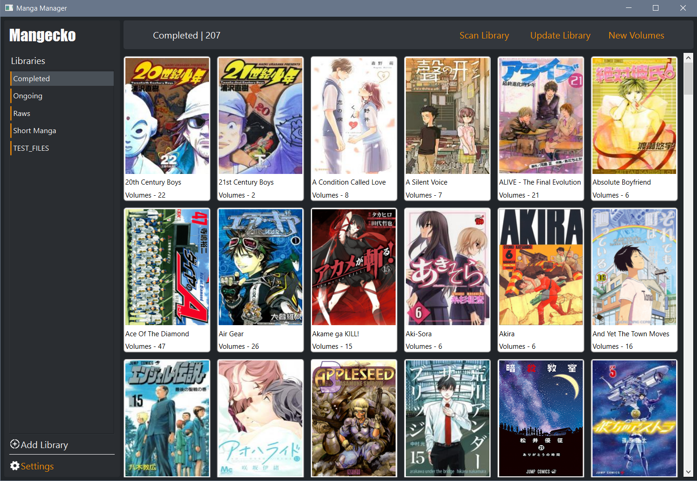

# Mangecko

## Overview

Mangecko is a WIP manga cataloging program to visually keep track of your digital manga collection.

## How to Use

Most features are working as intended but there's still a lot of work to do.

1. Run "mangecko.py" to launch the application.
2. Click on "Add Library" and follow the steps.
3. To update a libray, use the buttons on the top left. Scan Library -> Update Library -> New Volumes.

## A Note on File Organization

Like most media trackers/scanners/organization tools there is list of criteria that is necessary to follow in order to properly find files and folders.

1. Each series must be in its own folder.
    * Series name should be as accurate as possible without any extra things at the end.
2. Volumes should be named as cleanly as possible (Series title, volume number).
    * Bonus volumes, extras, etc., should be in their own folder. Still working on handling this.

As of now I don't do any sort of volume filename parsing to accurately count the total number of volumes. Right now it just looks for the filename extension and counts those up.

* Extensions: .cbr, .cbz, .zip, and PDF

## Tech Stack

After a couple of months I'm pretty well ingrained in the following:

* Python
* PyQT / PySide6
* SQLite

It will be a pretty basic CRUD app but I want to focus on the look and feel, responsiveness, and good software engineering principles and design.

## Mega Todo List and Bugfixes

* Main window
  * [ ] Library buttons - Errors out when clicked and no library is selected.
  * [ ] Library view - Needs to scroll back to top when switching libraries.
  * [ ] Add library/settings buttons get cut off on the right side when hovering.
  * [ ] Some sort of indicator for series that need to be updated?
  * [ ] A way to manually edit a series and maintain that through future updating.

* Add Library Dialog
  * [ ] Callback - Should probably improve how the name of the new library gets sent back.
  * [ ] Cover image downloading - incorporate into loading bar.

* Update Library Dialog
  * [ ] Display info about which series actually got updated, not just the entire list of ongoing series.

* Web scraper
  * [ ] Find improperly matched series and update edge cases.
  * [ ] Tweak the fuzzy string matching to better match series.

* Directory scanner
  * [ ] Check for omnibuses or multi-volume files.
